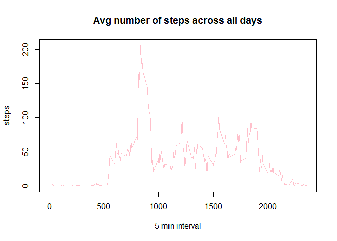

# Reproducible Research: Peer Assessment 1


###Loading and preprocessing the data

```r
activity <- read.csv("C:/Users/Micika/Desktop/skola/R programming/gettingcleaning/RepData_PeerAssessment1/activity.csv")
```

---

###What is mean total number of steps taken per day?
*Steps per day*

```r
allsteps<-aggregate(steps~date, activity,sum,na.rm=TRUE)
```


*Histogram*

```r
hist(allsteps$steps,col="pink",border="purple",main="Steps per day",xlab="Steps",ylab="Days")
```

 

*Mean*

```r
mean(allsteps$steps)
```

```
## [1] 10766.19
```

*Median*

```r
median(allsteps$steps)
```

```
## [1] 10765
```

---

###What is the average daily activity pattern?

```r
timesseries<-aggregate(steps~interval,data=activity,mean)
```

*Time Series plot*

```r
plot(timesseries$interval, timesseries$steps, type="l",main="Avg number of steps across all days", xlab="5 min interval", ylab="steps",col="pink")
```

 

*Which 5-minute interval, on average across all the days in the dataset, contains the maximum number of steps?*

```r
timesseries$interval[which.max(timesseries$steps)]
```

```
## [1] 835
```

---

###Imputing missing values
*total number of NAs*

```r
sum(is.na(activity))
```

```
## [1] 2304
```

---

###Strategy- subsetting interval mean for NAs

```r
intervalmean=aggregate(steps~interval, data=activity,mean, na.rm=TRUE)
activitynew<-activity
for(i in 1:nrow(activitynew))
        {
                if (is.na(activitynew[i, ]$steps))
                {
                        activitynew[i,]$steps<-subset(intervalmean,interval==activity[i,]$interval)$steps
                }
        }
```

*New Steps per day*

```r
allstepsnew=aggregate(steps~date, data=activitynew,sum, na.rm=TRUE)
```

*New Mean*

```r
mean(allstepsnew$steps)
```

```
## [1] 10766.19
```

*New Median*

```r
median(allstepsnew$steps)
```

```
## [1] 10766.19
```

*New histogram*

```r
hist(allsteps$steps,col="pink",border="purple",main="Steps per day",xlab="Steps",ylab="Days")
```

 

Mean is the same, and median is slightly different

---

###Are there differences in activity patterns between weekdays and weekends?

```r
whatday<-function(date)
        {
        day<-weekdays(date)
        if(day%in%c("Monday", "Tuesday", "Wednesday", "Thursday", "Friday")) 
        return("weekday") else if (day %in% c("Saturday", "Sunday")) 
        return("weekend") else stop("ERROR")
}
activitynew$date <- as.Date(activitynew$date)
activitynew$day <- sapply(activitynew$date, FUN = whatday)
```

*Plot*

```r
library(lattice)
stepsIntervalnew = aggregate(steps ~ interval + day, activitynew, mean)
xyplot(steps~interval | factor(day), data=stepsIntervalnew, aspect=1/2, type="l", col="pink")
```

 


